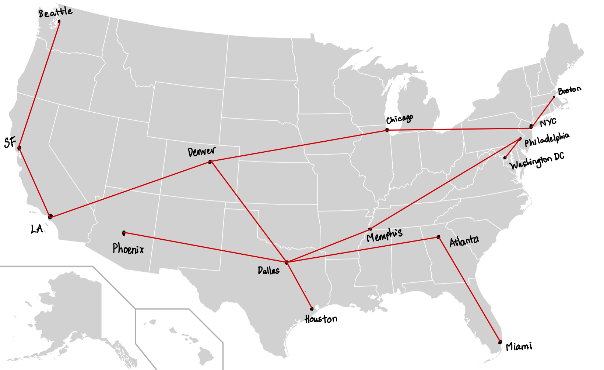

# Homework 6

**Name**: Nha Truong

**Student ID**: 10070780

**Due**: Dec 14, 2024

## Q1 -  Dijkstra's Algorithm
```
--- Relaxation History ---
Node(A) with Weight: 0 is added to the 'Visited'
	Relaxed: vertex[B]: OLD: inf, NEW: 4, Paths: {'B': 'A'}
	Relaxed: vertex[C]: OLD: inf, NEW: 2, Paths: {'B': 'A', 'C': 'A'}
Node(C) with Weight: 2 is added to the 'Visited'
	Relaxed: vertex[B]: OLD: 4, NEW: 3, Paths: {'B': 'C', 'C': 'A'}
	Relaxed: vertex[E]: OLD: inf, NEW: 7, Paths: {'B': 'C', 'C': 'A', 'E': 'C'}
	Relaxed: vertex[D]: OLD: inf, NEW: 6, Paths: {'B': 'C', 'C': 'A', 'E': 'C', 'D': 'C'}
Node(B) with Weight: 3 is added to the 'Visited'
	No edge relaxation is needed for node C
	Relaxed: vertex[D]: OLD: 6, NEW: 5, Paths: {'B': 'C', 'C': 'A', 'E': 'C', 'D': 'B'}
	Relaxed: vertex[E]: OLD: 7, NEW: 6, Paths: {'B': 'C', 'C': 'A', 'E': 'B', 'D': 'B'}
Node(D) with Weight: 5 is added to the 'Visited'
	No unvisited outgoing edges from the node D
Node(E) with Weight: 6 is added to the 'Visited'
	No edge relaxation is needed for node D

--- Final Results ---
Shortest Paths: {'D': 5, 'A': 0, 'B': 3, 'C': 2, 'E': 6}
Previous Nodes: {'B': 'C', 'C': 'A', 'E': 'B', 'D': 'B'}
```

## Q2 - Dijkstra's SSSP and MST Algorithms
```
--- Shortest Paths (SSSP) ---
Distance from Denver to Denver         : 0 with path [Denver]
Distance from Denver to Dallas         : 1064 with path [Denver to Dallas]
Distance from Denver to LA             : 1335 with path [Denver to LA]
Distance from Denver to Memphis        : 1411 with path [Denver to Memphis]
Distance from Denver to Houston        : 1426 with path [Denver to Dallas to Houston]
Distance from Denver to Chicago        : 1474 with path [Denver to Chicago]
Distance from Denver to SF             : 1894 with path [Denver to LA to SF]
Distance from Denver to Atlanta        : 2221 with path [Denver to Dallas to Atlanta]
Distance from Denver to Washington     : 2395 with path [Denver to Washington]
Distance from Denver to Phoenix        : 2486 with path [Denver to Dallas to Phoenix]
Distance from Denver to Philadelphia   : 2594 with path [Denver to Washington to Philadelphia]
Distance from Denver to NY             : 2619 with path [Denver to Chicago to NY]
Distance from Denver to Boston         : 2839 with path [Denver to Boston]
Distance from Denver to Seattle        : 2879 with path [Denver to LA to Seattle]
Distance from Denver to Miami          : 3194 with path [Denver to Dallas to Atlanta to Miami]

--- Minimum Spanning Tree (MST) ---
Denver is selected. Distance: 0
Dallas is selected. Distance: 1064
Houston is selected. Distance: 362
Memphis is selected. Distance: 675
Atlanta is selected. Distance: 1157
Miami is selected. Distance: 973
LA is selected. Distance: 1335
SF is selected. Distance: 559
Seattle is selected. Distance: 1092
Philadelphia is selected. Distance: 1413
Washington is selected. Distance: 199
Phoenix is selected. Distance: 1422
Chicago is selected. Distance: 1474
NY is selected. Distance: 1145
Boston is selected. Distance: 306

		Edge			Weight

         Denver          Denver ..............0
         Denver          Dallas ...........1064
         Dallas         Houston ............362
         Dallas         Memphis ............675
         Dallas         Atlanta ...........1157
        Atlanta           Miami ............973
         Denver              LA ...........1335
             LA              SF ............559
             SF         Seattle ...........1092
        Memphis    Philadelphia ...........1413
   Philadelphia      Washington ............199
         Dallas         Phoenix ...........1422
         Denver         Chicago ...........1474
        Chicago              NY ...........1145
             NY          Boston ............306

Total MST Weight: 13176
```


## Q3 - TinyZip and TinyUnzip

```
Enter an file name to encode:  King.txt

Character 		Weight 		Huffman Code

' '				1623		111
e				885			010
a				539			0111
i				542			1000
n				450			0011
o				604			1010
r				413			0000
s				419			0001
t				656			1011
d				254			01101
f				220			00101
h				385			11011
l				328			11000
b				110			011000
c				176			110100
g				167			100111
m				181			110101
u				175			110011
w				146			100101
y				124			011001
\n				58			0010011
,				71			1001001
.				75			1001100
k				51			0010010
p				93			1100101
v				81			1100100
I				23			00100000
N				24			00100010
"				12			001000010
A				18			100110100
L				12			001000011
T				14			100100000
W				18			100110101
j				20			100110111
!				8			1001000010
'				8			1001000011
G				9			1001000111
M				7			0010001111
S				8			1001000110
q				6			0010001101
z				6			0010001110
B				4			10010001010
C				6			10011011011
F				4			10010001011
O				4			10011011000
Y				3			00100011000
x				5			10011011010
-				2			001000110011
:				2			100100010000
;				2			100100010001
P				3			100110110011
—				1			001000110010
?				1			1001000100100
D				1			1001000100101
E				1			1001000100110
H				1			1001000100111
J				1			1001101100100
R				1			1001101100101


Expected cost of Huffman code cost: 39654
Expected cost of ASCII cost: 72504
Huffman efficiency improvement over ASCII code: 45%
Expected cost of optimal FCL cost: 54378
Huffman efficiency improvement over FCL: 27%
The size of King.txt: 9063
The size of King.zip: 4957
The size of King_unzipped.txt: 9063
```


